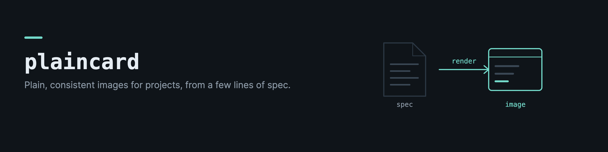
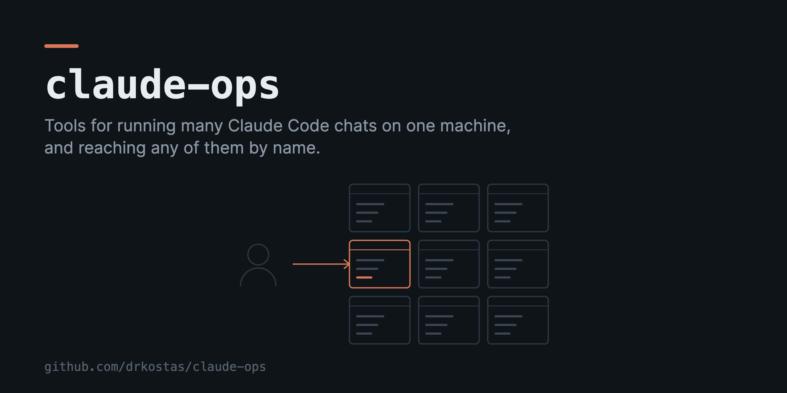
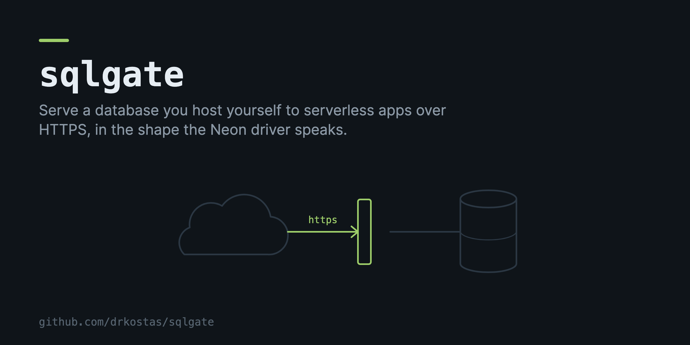
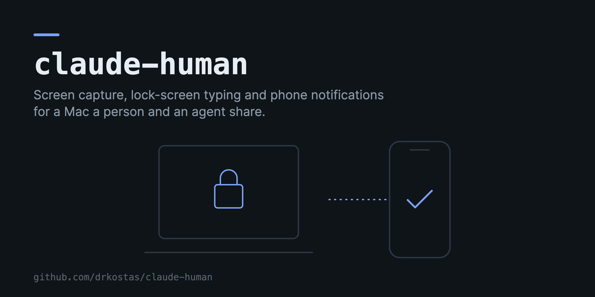
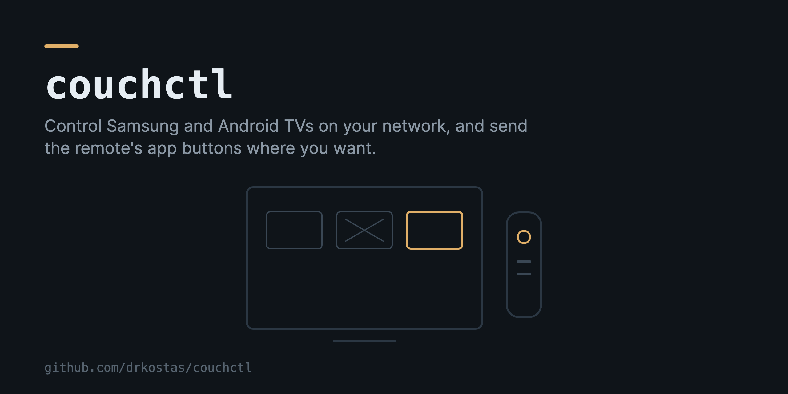

# plaincard

plaincard draws plain, consistent images for software projects from a few lines of spec. It makes
project cards (for a portfolio page or a repository's social preview), header banners and diagrams
for READMEs, and small square icons. Every image has the same dark background, the project name in a
monospace face, one line in plain words, and a small flat drawing of what the project does, with one
accent colour.

I made it because I wanted images for my own repositories that did not look like generic stock art
and that still matched each other. It is also a Claude Code plugin, so an agent working in any of my
projects can make an image in the same style.

| | |
|---|---|
|  |  |
|  |  |

## Install

```bash
pip install plaincard            # the command and the Python API
pip install 'plaincard[mcp]'     # also the MCP server
```

PNG export uses a local Chrome or Chromium (set `PLAINCARD_CHROME` to choose one). Without a
browser, plaincard still writes the SVG.

## Use

Write a spec, for example `.plaincard/sqlgate.yaml`.

```yaml
kind: card                  # card 1280x640, banner 1600x400, diagram 1200x480, icon 512x512
name: sqlgate
line: "Serve a database you host yourself to serverless apps over HTTPS."
accent: green               # clay, blue, amber, green, violet, teal, rose, sky, or #rrggbb
footer: github.com/drkostas/sqlgate
diagram:                    # parts from left to right, joined by edges
  - cloud
  - arrow: https            # arrow, dots or line, with an optional label
  - gate
  - line
  - db
```

Then render it.

```bash
plaincard render .plaincard/sqlgate.yaml -o images   # images/sqlgate.svg and images/sqlgate.png
plaincard parts                                      # every part, edge, accent and kind
plaincard example banner                             # a starting spec for a kind
```

The PNG is twice the canvas size, so it stays sharp on high density screens. The SVG is the source
and can be used directly where SVG is allowed.

It can also be called from Python.

```python
from plaincard import render_file, render_spec
render_file(".plaincard/sqlgate.yaml", "images")
render_spec({"kind": "icon", "diagram": ["db"]}, "images", "db")
```

## Parts

pane, panes (a grid with one highlighted), terminal, phone (`model: ios` or `android`, or
`shows: lock` or `check`), laptop, tv (app tiles, one crossed out, one highlighted), remote, cloud,
db, gate, server, doc, folder, lock, check, user, globe, chart, heart, note (music), watch, cube, and box
(a labelled box for anything else).
Each part is quiet unless the spec marks it `accent: true`. A gate, lock, check and remote are lit by
default. Any part can take a `label`.

## Rules it keeps

The text owns the top of the canvas and the drawing is fitted into the space below it, so text and
drawing never overlap. A name that does not fit, a line longer than about two lines, an unknown part
or option, two edges in a row, and YAML it cannot read are all refused with a message that says what
to change. Colours, fonts and line weights live in one file (`style.py`), so every image can be
restyled together by rendering the specs again.

## Claude Code

The repository is a Claude Code plugin. It adds a `plaincard` skill (when to make an image and how
to write a good spec), a `/plaincard` command, and an MCP server with `render_image`, `list_parts`
and `example`.

```bash
claude plugin install /path/to/plaincard   # or add it from a marketplace that lists it
```

The MCP server needs `pip install 'plaincard[mcp]'` so that `plaincard-mcp` is on the path.

## License

MIT
